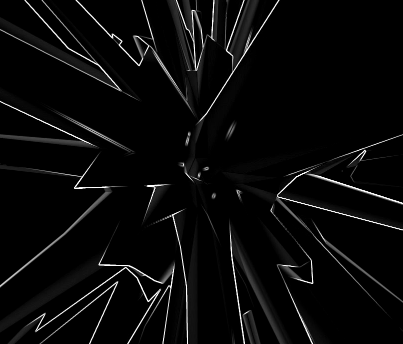

# td-particle-edge

A TouchDesigner animation of a particle system that deforms a sphere and uses edge detection to create jagged shards.

## introduction

 This is my first animation with the amazing TouchDesigner application, which you can download freely for non-commercial use from https://derivative.ca/. Experienced TouchDesigner users will find this animation to be trivial but I am amazed at its power and I look forward to many years of fun experimentation ahead.
 
 ## credits 
 
 Many thanks to bileam tshepe on YouTube at https://www.youtube.com/channel/UCONptu0J1PCrW9YfBtSdqjA for demonstrating how to make cool things.

## contact

- https://instagram.com/amberdabber
- https://linkedin.com/in/davepinch

